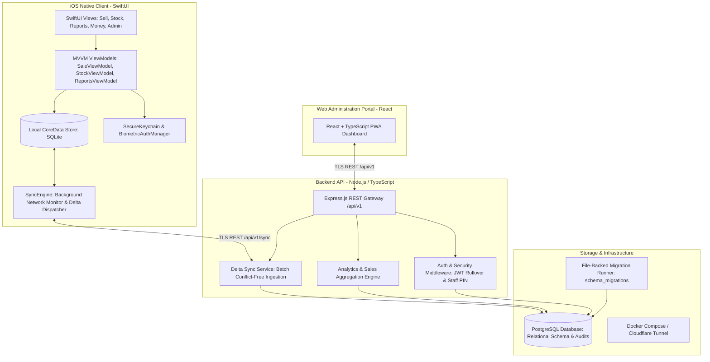

# Venda: Offline-First Point-of-Sale & Commerce Platform for Emerging Markets

Venda is a full-stack, offline-first Point-of-Sale (POS), inventory management, and digital commerce platform tailored for African emerging retail environments (with native support for Zambian Kwacha [ZMW], Mobile Money reconciliation [Airtel Money / MTN MoMo], customer credit ledgers, and multi-tenant merchant controls).

The ecosystem consists of:
1. **iOS Native Client** (`Venda/`): A SwiftUI + CoreData application engineered for offline transactions, background delta synchronization, biometric staff authentication, and dynamic pricing models.
2. **Backend API Service** (`Backend/`): A high-concurrency Node.js + TypeScript REST API backed by PostgreSQL, featuring versioned file-based database migrations, cryptographic JWT rollover, and real-time reconciliation.
3. **Web & PWA Dashboard** (`Web/`): A React + TypeScript web portal for inventory administration, merchant analytics, and downloadable audit reports.
4. **Comprehensive Specifications & System Documentation** (`docs/`): Full architectural blueprints, data models, API contracts, and deployment runbooks.

---

## System Architecture

Venda leverages an offline-first distributed architecture where retail transactions are committed locally to CoreData with optimistic UI updates and queued for bi-directional delta synchronization once network connectivity is established.



---

## Core Engineering Highlights

### 1. Offline-First Resilience & Bi-Directional Delta Sync
- **Local-First CoreData Persistence**: Complete POS transactions, receipt generation, and stock deductions execute instantaneously offline with zero network latency.
- **Delta-Based Synchronization**: Entities (`Product`, `Sale`, `SaleLineItem`, `MoMoTransaction`, `CreditEntry`, `Staff`) track `createdAt`, `updatedAt`, and `syncedAt` timestamps with UUID primary keys to ensure conflict-free batch merging on reconnection.
- **Atomic Mobile Money Matching**: Cashiers can record customer Mobile Money transaction references locally; the system cross-references backend payment webhooks asynchronously to reconcile unverified receipts.

### 2. Flexible Pricing Matrix & Loss Prevention Audit
- **Multi-Modal Pricing**: Supports `Fixed`, `Range` (negotiated market pricing within strict min/max boundaries), `Open`, and `Staff-Overridden` pricing models.
- **Price Override Auditing**: Every negotiated price reduction requires cashier PIN authorization and persists an immutable audit trail (`originalPrice`, `unitPrice`, `discountAmount`, `discountReason`, `priceOverrideBy`) to prevent merchant shrinkage.

### 3. Credit & Customer Tab Management
- **Informal Credit Ledger**: Native tracking of customer store credit (`CreditEntry`) with due dates, repayment histories, and partial settlement workflows.

### 4. Enterprise Security & Session Lifecycle
- **Zero-Trust Token Rollover**: Backend supports seamless zero-downtime JWT key rotation using primary (`JWT_SECRET`) and verification fallback (`JWT_SECRET_PREVIOUS`) keys.
- **Multi-Tenant Data Isolation**: All database queries enforce strict tenant scoping (`merchant_id`).
- **Hardware-Isolated Credentials**: The iOS client encrypts session tokens and merchant encryption keys inside the iOS Secure Keychain via `Security.framework`.
- **Biometrics & Rapid PIN Authentication**: Face ID / Touch ID quick-unlock for managers, paired with a custom high-performance numpad for instant cashier switching.

### 5. Inclusive Design & Full Accessibility
- **Custom Design Tokens**: High-contrast, sunlight-readable color palettes designed specifically for outdoor market stalls.
- **Dynamic Type & VoiceOver**: Complete accessibility labels, traits, and accessibility modifiers across all sales workflows.

---

## Repository Structure

```text
Venda/
├── Venda/                            # iOS Native SwiftUI Application
│   ├── App/                          # App lifecycle, AppState, and session storage
│   ├── Models/                       # CoreData models (VendaModel.xcdatamodeld), ProductModel
│   ├── ViewModels/                   # MVVM business logic (Sale, Stock, Money, Reports)
│   ├── Views/                        # Primary screen modules
│   │   ├── SellScreen.swift          # Core POS checkout terminal & cart
│   │   ├── StockScreen.swift         # Inventory catalog, categories, stock alerts
│   │   ├── MoneyScreen.swift         # Cash drawer, MoMo reconciliation, credit ledger
│   │   ├── ReportsScreen.swift       # Revenue charts, margin calculations, top products
│   │   ├── AdminPanelScreen.swift    # Multi-staff management and permissions
│   │   └── Onboarding/               # Merchant registration & setup wizard
│   ├── Components/                   # Reusable UI primitives (Buttons, Badges, PINPad)
│   ├── Services/                     # SyncEngine, PersistenceService, PricingService, NetworkService
│   ├── Extensions/                   # Currency, Date, and Color formatting helpers
│   └── Accessibility/                # VoiceOver and contrast modifiers
├── Backend/                          # Node.js + TypeScript API Gateway
│   ├── src/
│   │   ├── controllers/              # Auth, Products, Sales, Sync, Staff, Reports, Money
│   │   ├── middleware/               # Multi-tenant auth, error handling, rate limiting
│   │   ├── config/                   # Database connection, migrations, environment validation
│   │   └── index.ts                  # Server entry point
│   ├── migrations/                   # File-backed SQL migrations (0001_initial_schema.sql)
│   ├── test/                         # Comprehensive unit and integration test suite
│   ├── Dockerfile                    # Container definition
│   └── docker-compose.yml            # Local development database & API stack
├── Web/                              # React + TypeScript Admin Dashboard & PWA
├── docs/                             # Deep architectural & API specifications
│   ├── architecture.md               # Detailed system design
│   ├── api.md                        # OpenAPI / REST endpoint contracts
│   ├── data-model.md                 # Entity relationship diagrams & database schema
│   ├── ios-app.md                    # iOS client architecture guide
│   ├── backend.md                    # Server architecture guide
│   └── setup.md                      # Local environment setup
├── scripts/                          # Deployment and automation scripts
└── Venda.xcodeproj                   # Xcode project configuration
```

---

## Technology Stack

| Component | Technologies | Purpose |
|---|---|---|
| **iOS Client** | SwiftUI, CoreData, Combine, Swift Concurrency, Security.framework | Native iOS Point-of-Sale client |
| **Backend Service** | Node.js, TypeScript, Express.js, `pg` (PostgreSQL client) | REST API & synchronization gateway |
| **Database** | PostgreSQL 16+ with UUID extensions & file-based migrations | Relational data persistence & audit store |
| **Web Dashboard** | React 18, TypeScript, Vite, Tailwind CSS | Management portal & PWA |
| **Infrastructure** | Docker, Docker Compose, Cloudflare Tunnels, Bash | Containerized deployment & secure networking |
| **Security** | Argon2 / bcrypt, JWT with key rollover, iOS Keychain Enclave | Cryptographic security & multi-tenant isolation |

---

## Quick Start & Setup Guide

### 1. iOS Application Setup
1. Open `Venda.xcodeproj` in Xcode 16+.
2. Select the `Venda` scheme and target an iOS 17.0+ Simulator (e.g. iPhone 16 Pro).
3. (Optional) To point the iOS app to a custom local backend, set `VENDA_API_BASE_URL` in `Info.plist` or via runtime environment arguments.
4. Press `Cmd + R` to build and run.

### 2. Backend Local Development Stack
```bash
# Navigate to Backend
cd Backend

# Install dependencies
npm install

# Configure environment
cp .env.example .env
# Edit .env with your local credentials and a secure JWT_SECRET

# Start PostgreSQL and Backend via Docker Compose
docker compose up --build
```

### 3. Database Migrations & Verification
```bash
# Run file-backed SQL migrations
npm run db:migrate

# Verify schema integrity
npm run db:verify

# Run test suite
npm test
```

### 4. Web Dashboard Setup
```bash
cd Web
npm install
npm run dev
```

---

## Production Deployment

Production deployments are automated via Docker Compose and Cloudflare Tunnels:
```bash
./scripts/deploy-homeserver.sh
```
The production stack preserves existing PostgreSQL volumes and executes checksummed migrations before accepting client traffic.

---

## Author & License

- **Developer**: Joseph Ngandu ([@joseph0ngandu-ui](https://github.com/joseph0ngandu-ui))
- **License**: MIT License
